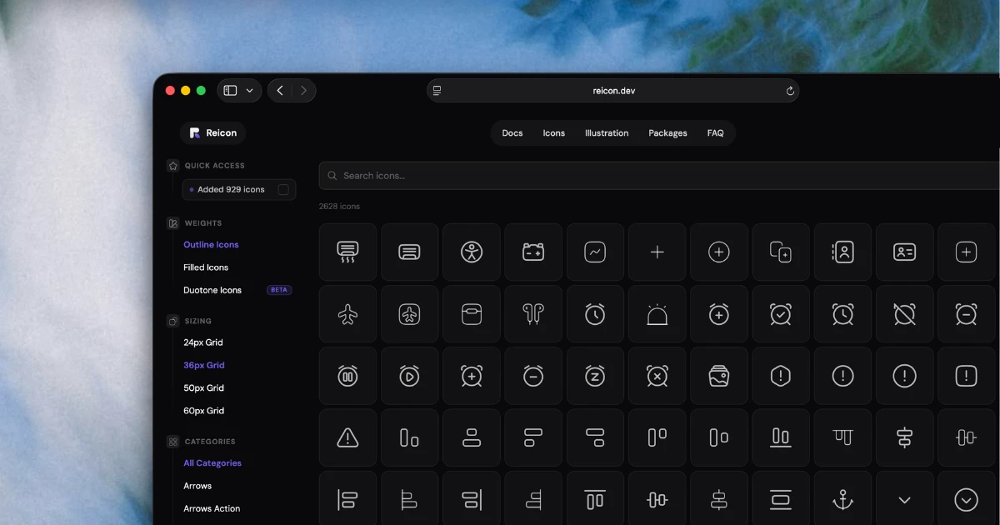
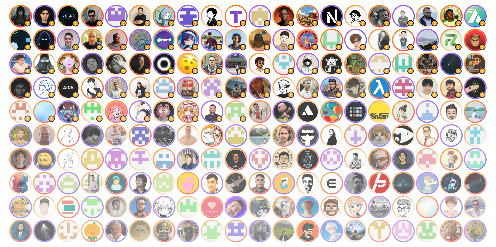

  

  
  

  <a href="https://reicon.dev/icons">Icons</a>
  ·
  <a href="https://reicon.dev/docs">Guide</a>
  ·
  <a href="#packages">Packages</a>
  ·
  <a href="https://github.com/dqev/reicon/blob/main/LICENSE">License</a>

# Reicon

Reicon is a free, open-source vector graphics library with 3,900+ SVG icons, 71,000+ illustrations, and 4,900+ brand logos — built for designers and developers. Official packages for React, Vue, Svelte, React Native, Flutter, JavaScript, Figma, VS Code, and AI MCP agents. MIT licensed.

## Packages

| Logo | Package | Version | Downloads | Links |
| ---- | ------- | ------- | --------- | ----- |
|  | **`reicon`** |  |  | [Docs](https://reicon.dev/docs/vanilla) · [Source](./packages/reicon) |
|  | **`reicon-react`** |  |  | [Docs](https://reicon.dev/docs/react) · [Source](./packages/reicon-react) |
|  | **`reicon-react-native`** |  |  | [Docs](https://reicon.dev/docs/react-native) · [Source](./packages/reicon-react-native) |
|  | **`reicon-vue`** |  |  | [Docs](https://reicon.dev/docs/vue) · [Source](./packages/reicon-vue) |
|  | **`reicon-svelte`** |  |  | [Docs](https://reicon.dev/docs/svelte) · [Source](./packages/reicon-svelte) |
|  | **`reicon-flutter`** |  |  | [Docs](https://reicon.dev/docs/flutter) · [Source](./packages/reicon-flutter) |
|  | **`reicon-mcp`** |  |  | [Docs](https://reicon.dev/docs/mcp) · [Source](./packages/reicon-mcp) |
|  | **`reicon-figma`** |  |  | [Docs](https://reicon.dev/docs/figma) · [Source](./packages/reicon-figma) |
|  | **`reicon-vscode`** |  |  | [Docs](https://reicon.dev/docs/vscode) · [Source](./packages/reicon-vscode) |

## Contributing

For more info on how to contribute please see the [contribution guidelines](CONTRIBUTING.md).

## License

Reicon is totally free for commercial use and personal use, this software is licensed under the [MIT License](LICENSE).

## Credits

Thank you to all the people who contributed and supported Reicon!

Reicon base icons are built using elements from:
* [Solar Icons](https://solar-icons.vercel.app/) designed by **480 Design** (CC BY 4.0)
* [Zappicon](https://zappicon.com/)

## Sponsors

Thanks to [Vercel](https://vercel.com/?utm_source=reicon&utm_campaign=oss) for their support of open-source software.

